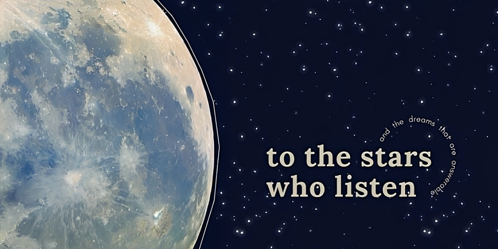
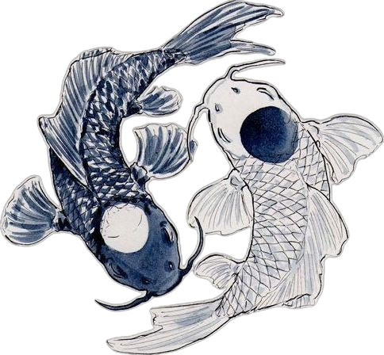
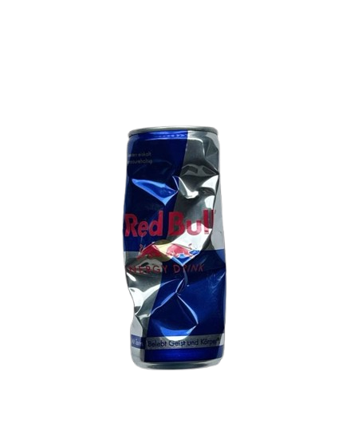

<p align="center">

</p>

<h1 align="center">Hi, I'm Zainab 👋</h1>

<p align="center">
Software Developer • First-Year ICS Student • Pakistan
</p>

---



## 🌙 About Me

```cpp
class Zainab {
public:
    string role = "Software Developer";
    string education = "ICS Student";

    vector<string> learning = {
        "HTML",
        "CSS",
        "JavaScript",
        "Python",
        "Git & GitHub"
    };

    vector<string> interests = {
        "Artificial Intelligence",
        "Web Development",
        "Data Science",
        "UI/UX Design"
    };
};
```

- 🌱 Currently building beginner-friendly projects
- 💙 Love minimal UI & clean code
- ☕ Fueled by coffee & curiosity

<br clear="right"/>

---

## ⚡ Tech Stack

<p align="center">


</p>

---



## 🚀 Current Projects

- 🌦️ Weatherly
- 🎬 Netflix Matchmaker
- 📝 Notes App
- 🎮 Tic Tac Toe
- 🔗 URL Shortener

<br clear="left"/>

---

## 🌐 Connect

<p align="center">

<a href="https://www.instagram.com/zey_cookss/">

</a>

<a href="mailto:zainabzulfiqar.kaboom@gmail.com">

</a>

</p>
