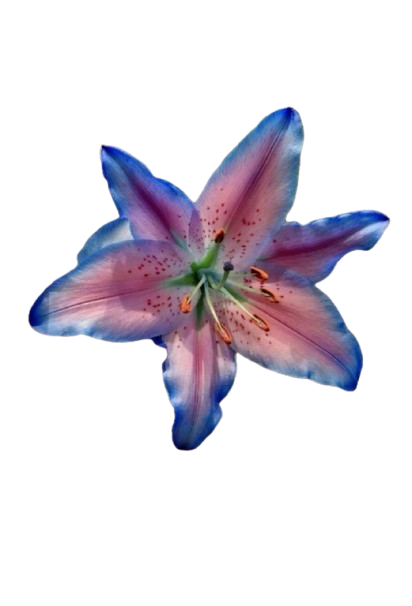

# 𝒁𝒂𝒊𝒏𝒂𝒃 𝒁𝒖𝒍𝒇𝒊𝒒𝒂𝒓

### 「 First-Year ICS Student • Always Learning And Coding 」

*"Building meaningful projects, one commit at a time."*

<table width="100%">
<tr>

<td width="70%" valign="top">

<h2>About Me</h2>

Hi! I'm <b>Zainab</b>, a first-year ICS student from Pakistan who enjoys learning new technologies and building beginner-friendly projects. I'm currently exploring HTML, CSS, JavaScript, Python, and Git while improving my programming and problem-solving skills. I enjoy creating clean, interactive websites and continuously expanding my knowledge through personal projects. My current interests include web development, artificial intelligence, data science, and UI/UX design.

<h3>Currently Learning</h3>

<ul>
<li>HTML</li>
<li>CSS</li>
<li>JavaScript</li>
<li>Python</li>
<li>Git & GitHub</li>
</ul>

<h3>Interests</h3>

<ul>
<li>Web Development</li>
<li>Artificial Intelligence</li>
<li>Data Science</li>
<li>UI/UX Design</li>
</ul>

</td>

<td width="30%" align="center">

</td>

</tr>
</table>

𓏲๋࣭࣪˖🪼.ᐟ <b>Tech Stack:</b> 
             

---
# Github Stats ✭
 

<table width="100%" style="width:100%; border:3px solid #FFB6D9; border-radius:20px; border-collapse:collapse; background-color:#FFF7FB;">

<tr>

<td width="35%" align="center" valign="middle" style="padding:40px; border-right:3px solid #FFD3E8;">

</td>

<td width="65%" valign="middle" style="padding:40px;">

<h2 style="margin-top:0; color:#FF69B4; font-family:Arial,sans-serif; font-size:36px;">
🚀 Current Projects
</h2>

🌦️ <b>Weatherly – Live weather forecasting app (Live Demo)
</b>  

🎬 <b>Netflix Matchmaker</b> <i>(Coming Soon)</i>  

</td>

</tr>

</table>

## 🌐 Connect With Me

---

> **"Code. Learn. Build. Repeat."**

⭐ Thanks for visiting my profile!

